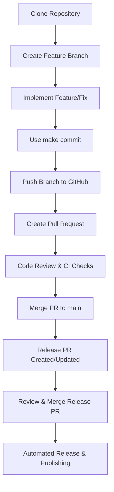

# Development and Release Workflow

This document provides a comprehensive guide for the development workflow from local coding to npm package publication.

## Development Workflow Overview



## Detailed Steps

### For Developers

#### 1. Initial Setup

1. Clone the repository:

   ```bash
   git clone https://github.com/organization/image-sizes.git
   cd image-sizes
   ```

2. Set up the development environment:

   ```bash
   make docker-build  # Build the Docker container
   make install       # Install dependencies
   ```

#### 2. Feature Development

1. Create a new feature branch:

   ```bash
   git checkout -b feature/your-feature-name
   ```

2. Make your changes to the codebase

   ```bash
   make dev         # Start development mode with hot reloading
   make test        # Run tests to verify your changes
   make lint        # Run linter to ensure code quality
   ```

#### 3. Committing Changes

1. Stage your changes:

   ```bash
   git add .
   ```

2. Commit using conventional commits format:

   ```bash
   make commit
   ```

   This will guide you through creating a properly formatted commit message:
   - Choose a commit type (feat, fix, docs, etc.)
   - Optionally specify a scope
   - Write a short description
   - Optionally add a longer description and/or breaking changes

   Examples of good commit messages:
   - `feat(builder): add support for percent calculations`
   - `fix: correct media query generation for max width`
   - `docs: improve API documentation`
   - `chore: update dependencies`

3. Push your branch to GitHub:

   ```bash
   git push origin feature/your-feature-name
   ```

#### 4. Pull Request

1. Go to the GitHub repository
2. Create a new Pull Request for your branch
3. Fill in the PR template with details about your changes
4. Wait for CI checks to complete
5. Address any review feedback by making additional commits
6. Once approved, your PR will be merged to main

### For Maintainers

#### 5. Automated Release Process

Once PRs are merged to main, the following automated steps occur:

1. **Release Please Workflow** analyzes conventional commits and:
   - Determines the appropriate semantic version bump
   - Creates/updates a Release PR with:
     - Updated version in package.json
     - Generated/updated CHANGELOG.md
     - Prepared release commit

2. **Release PR Review**:
   - Review the proposed version change and changelog
   - Merge the Release PR when ready to publish a new version

3. **Automated Publishing** (triggered by merging the Release PR):
   - Creates a git tag (e.g., v1.2.0)
   - Creates a GitHub Release with release notes
   - Triggers the publish workflow that:
     - Builds the package
     - Runs tests and linting
     - Publishes to npm
     - Updates the GitHub Release with publication status

## Versioning Strategy

We follow [Semantic Versioning](https://semver.org/) with automated version determination based on conventional commits:

- **Major Version (x.0.0)**: Breaking changes  
  _Triggered by commits with `BREAKING CHANGE:` in the footer_
  
- **Minor Version (0.x.0)**: New features (backward compatible)  
  _Triggered by commits with `feat:` type_
  
- **Patch Version (0.0.x)**: Bug fixes (backward compatible)  
  _Triggered by commits with `fix:` type_

## Prerequisites for Publishing

Before you can publish to npm, you need to:

1. Have an npm account
2. Be added as a maintainer of the package (or own it)
3. Configure GitHub repository secrets

### Setting Up npm Token

1. Log in to your npm account on the command line:

   ```bash
   npm login
   ```

2. Generate an access token for GitHub Actions:

   ```bash
   npm token create
   ```

3. Copy the generated token (it will only be displayed once)

### Setting Up GitHub Repository

1. Go to your GitHub repository
2. Navigate to "Settings" > "Secrets and variables" > "Actions"
3. Click "New repository secret"
4. Name: `NPM_TOKEN`
5. Value: Paste the npm token you generated
6. Click "Add secret"

## Troubleshooting

If the publish fails:

1. Check the GitHub Actions logs for errors
2. Verify that the NPM_TOKEN is valid and has publish permissions
3. Check if the package name is available on npm
